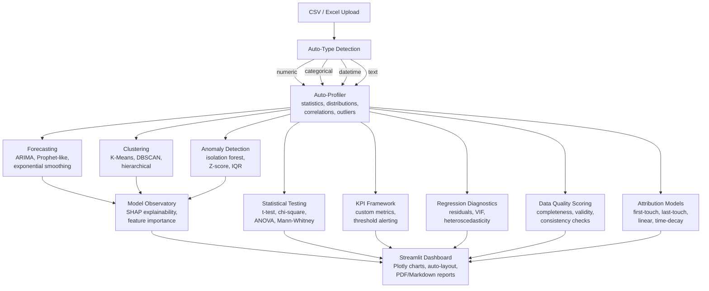

[](https://github.com/sponsors/ChunkyTortoise)

# Insight Engine

**Marketing teams waste 8+ hours/week building reports from spreadsheets.** Upload a CSV or Excel file and get instant dashboards, predictive models, marketing attribution, and downloadable reports.


[](https://ct-insight-engine.streamlit.app)

**[Live Demo](https://ct-insight-engine.streamlit.app)** -- try it without installing anything.

## Demo Snapshot


## What This Solves

- **Manual reporting burns time** -- Auto-profiler detects column types, distributions, outliers, and correlations in seconds
- **No visibility into which channels drive conversions** -- Four attribution models show exactly where marketing budget should go
- **Predictive modeling requires ML expertise** -- Upload labeled data, pick a target column, get a trained model with SHAP explanations
- **No way to segment customers** -- K-means and DBSCAN clustering with silhouette scoring for automatic customer segmentation
- **Forecasting requires specialized tools** -- Moving average, exponential smoothing, and ensemble forecasts from any time series column
- **Statistical validation is manual** -- Automated hypothesis testing selects the right test based on data characteristics

## Key Metrics

| Metric | Value |
|--------|-------|
| Test Suite | 520+ automated tests |
| Auto-Profile Speed | <2s for 100K row CSV |
| Supported Models | 8+ ML algorithms |
| Statistical Tests | 6 hypothesis tests |
| Attribution Models | 4 multi-touch models |
| Explainability | SHAP + feature importance |

## Service Mapping

- **Service 8:** Interactive Business Intelligence Dashboards
- **Service 9:** Automated Reporting Pipelines
- **Service 10:** Predictive Analytics and Lead Scoring
- **Service 16:** Marketing Attribution and ROI Analysis

## Certification Mapping

- Google Data Analytics Certificate
- IBM Business Intelligence Analyst Professional Certificate
- Microsoft Data Visualization Professional Certificate
- Microsoft Generative AI for Data Analysis Professional Certificate
- Google Business Intelligence Professional Certificate
- Google Advanced Data Analytics Certificate

## Architecture



## Modules

| Module | File | Description |
|--------|------|-------------|
| **Profiler** | `profiler.py` | Auto-detect column types, distributions, outliers, and correlations |
| **Dashboard Generator** | `dashboard_generator.py` | Plotly histograms, pie charts, heatmaps, scatter matrices |
| **Data Cleaner** | `cleaner.py` | Dedup (exact + fuzzy), column standardization, smart imputation |
| **Predictor** | `predictor.py` | Auto-detect classification/regression, gradient boosting, SHAP |
| **Attribution** | `attribution.py` | First-touch, last-touch, linear, time-decay marketing attribution |
| **Report Generator** | `report_generator.py` | Markdown reports with findings, metrics, chart placeholders |
| **Anomaly Detector** | `anomaly_detector.py` | Z-score and IQR outlier detection |
| **Advanced Anomaly** | `advanced_anomaly.py` | Isolation forest, LOF, multi-method ensemble detection |
| **Clustering** | `clustering.py` | K-means and DBSCAN with silhouette scoring and cluster comparison |
| **Feature Lab** | `feature_lab.py` | Feature scaling, encoding, polynomial features, interaction terms |
| **Forecaster** | `forecaster.py` | Moving average, exponential smoothing, linear trend, ensemble forecasts |
| **Statistical Tests** | `statistical_tests.py` | t-test, chi-square, ANOVA, Mann-Whitney, Kruskal-Wallis, Shapiro-Wilk |
| **KPI Framework** | `kpi_framework.py` | Custom KPI definitions, threshold alerting, trend tracking |
| **Model Observatory** | `model_observatory.py` | SHAP explanations, feature importance, model comparison |
| **Hypertuner** | `hypertuner.py` | Automated hyperparameter tuning with cross-validation |
| **Dimensionality** | `dimensionality.py` | PCA, t-SNE dimensionality reduction and visualization |
| **Regression Diagnostics** | `regression_diagnostics.py` | Residual analysis, VIF, heteroscedasticity testing |
| **Data Quality** | `data_quality.py` | Completeness, validity, and consistency scoring |

## Quick Start

```bash
git clone https://github.com/ChunkyTortoise/insight-engine.git
cd insight-engine
pip install -r requirements.txt
make test
make demo
```

### Docker

```bash
docker compose up
# Open http://localhost:8501
```

## Demo Datasets

| Dataset | Rows | Use Case |
|---------|------|----------|
| E-commerce Transactions | 1,000 | Revenue analysis, category distributions, return rates |
| Marketing Touchpoints | ~800 | Attribution modeling across 6 channels |
| HR Attrition | 500 | Predictive modeling (who will leave?) |

## Tech Stack

| Layer | Technology |
|-------|-----------|
| UI | Streamlit, Plotly |
| Data | Pandas, NumPy, openpyxl |
| ML | scikit-learn, XGBoost, SHAP |
| Testing | pytest (520+ tests) |
| CI | GitHub Actions (Python 3.11, 3.12) |
| Linting | Ruff |
| Container | Docker, Docker Compose |

## Project Structure

```
insight-engine/
├── app.py                          # Streamlit application
├── insight_engine/
│   ├── profiler.py                 # Auto-profiling + column type detection
│   ├── dashboard_generator.py      # Chart generation + layout
│   ├── attribution.py              # 4 marketing attribution models
│   ├── predictor.py                # Auto-ML + SHAP explanations
│   ├── cleaner.py                  # Dedup, standardize, impute
│   ├── report_generator.py         # Markdown/PDF report generation
│   ├── anomaly_detector.py         # Z-score + IQR outlier detection
│   ├── advanced_anomaly.py         # Isolation forest, LOF, ensemble
│   ├── clustering.py               # K-means, DBSCAN, silhouette scores
│   ├── feature_lab.py              # Feature scaling, encoding, polynomials
│   ├── forecaster.py               # Time series forecasting (4 methods)
│   ├── statistical_tests.py        # 6 hypothesis tests
│   ├── kpi_framework.py            # KPI definitions and alerting
│   ├── model_observatory.py        # SHAP + feature importance
│   ├── hypertuner.py               # Hyperparameter tuning
│   ├── dimensionality.py           # PCA, t-SNE reduction
│   ├── regression_diagnostics.py   # Residual analysis, VIF
│   └── data_quality.py             # Quality scoring
├── benchmarks/                     # Performance benchmarks
├── demo_data/                      # 3 sample datasets
├── docs/adr/                       # Architecture Decision Records
├── tests/                          # 19 test files, 520+ tests
├── .github/workflows/ci.yml        # CI pipeline
├── Dockerfile                      # Container image
├── docker-compose.yml              # Container orchestration
├── Makefile                        # demo, test, lint, setup
└── requirements.txt
```

## Architecture Decisions

| ADR | Title | Status |
|-----|-------|--------|
| [ADR-0001](docs/adr/0001-auto-type-detection.md) | Automatic Type Detection | Accepted |
| [ADR-0002](docs/adr/0002-four-attribution-models.md) | Four Attribution Models | Accepted |
| [ADR-0003](docs/adr/0003-shap-explainability.md) | SHAP Explainability | Accepted |

## Testing

```bash
make test                           # Full suite (520+ tests)
python -m pytest tests/ -v          # Verbose output
python -m pytest tests/test_profiler.py  # Single module
```

## Benchmarks

See [BENCHMARKS.md](BENCHMARKS.md) for detailed performance data.

```bash
python benchmarks/run_benchmarks.py
# Results written to benchmarks/RESULTS.md
```

## Related Projects

- [EnterpriseHub](https://github.com/ChunkyTortoise/EnterpriseHub) -- Real estate AI platform with BI dashboards and CRM integration
- [docqa-engine](https://github.com/ChunkyTortoise/docqa-engine) -- RAG document Q&A with hybrid retrieval and prompt engineering lab
- [ai-orchestrator](https://github.com/ChunkyTortoise/ai-orchestrator) -- AgentForge: unified async LLM interface (Claude, Gemini, OpenAI, Perplexity)
- [scrape-and-serve](https://github.com/ChunkyTortoise/scrape-and-serve) -- Web scraping, price monitoring, Excel-to-web apps, and SEO tools
- [prompt-engineering-lab](https://github.com/ChunkyTortoise/prompt-engineering-lab) -- 8 prompt patterns, A/B testing, TF-IDF evaluation
- [llm-integration-starter](https://github.com/ChunkyTortoise/llm-integration-starter) -- Production LLM patterns: completion, streaming, function calling, RAG, hardening
- [Portfolio](https://chunkytortoise.github.io) -- Project showcase and services

## Deploy

[](https://share.streamlit.io/chunkytortoise/insight-engine/main/app.py)

## Changelog

See [CHANGELOG.md](CHANGELOG.md) for release history.

## License

MIT -- see [LICENSE](LICENSE) for details.
